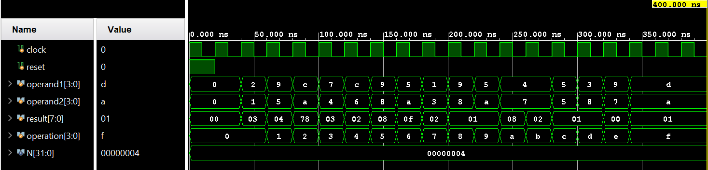

# run 1000ns

time=0,  reset=1,  operation= 0, operand1= 0, operand2= 0, result=  0

time=20000,  reset=0,  operation= 0, operand1= 0, operand2= 0, result=  0

time=40000,  reset=0,  operation= 0, operand1= 2, operand2= 1, result=  3

time=60000,  reset=0,  operation= 1, operand1= 9, operand2= 5, result=  4

time=80000,  reset=0,  operation= 2, operand1=12, operand2=10, result=120

time=100000,  reset=0,  operation= 3, operand1= 7, operand2= 4, result=  3

time=120000,  reset=0,  operation= 4, operand1=12, operand2= 6, result=  2

time=140000,  reset=0,  operation= 5, operand1= 9, operand2= 8, result=  8

time=160000,  reset=0,  operation= 6, operand1= 5, operand2=10, result= 15

time=180000,  reset=0,  operation= 7, operand1= 1, operand2= 3, result=  2

time=200000,  reset=0,  operation= 8, operand1= 9, operand2= 8, result=  1

time=220000,  reset=0,  operation= 9, operand1= 5, operand2=10, result=  1

time=240000,  reset=0,  operation=10, operand1= 4, operand2= 7, result=  8

time=260000,  reset=0,  operation=11, operand1= 4, operand2= 7, result=  2

time=280000,  reset=0,  operation=12, operand1= 5, operand2= 5, result=  1

time=300000,  reset=0,  operation=13, operand1= 3, operand2= 8, result=  1

time=320000,  reset=0,  operation=14, operand1= 9, operand2= 7, result=  0

time=340000,  reset=0,  operation=15, operand1=13, operand2=10, result=  1

$finish called at time : 400 ns

