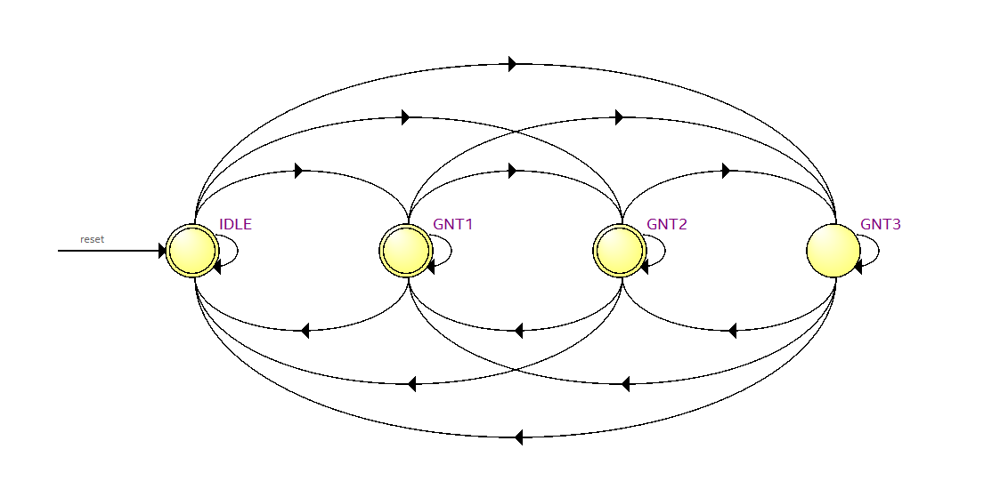
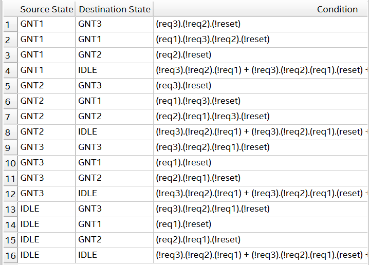

In a multi-core circuit, there cannot be a main memory for each of the CPU cores and generally we have a single shared memory that is being shared across all the cores. 

For example, we have 4 CPU cores accessing memory from s single main memory. We will have to have some sort of mechanism to choose as to which CPU claims the bus for communication. 

Signals(I/O Ports) : clk, reset, request signals from the core, Grant output.

Fixed point arbiters: Each CPU has a fixed priority (similiar to priority encoding). CPU3 > CPU2 > CPU1 > CPU0. We are allowed to give preference/priority to desired/particular CPU's. However, if the highest priority CPU accesses memory very frequently, then it might lead to starvation of the lower priority CPU requester.

Round robin arbiter: Each CPU will get priority for a fixed time, and then the priority will shift to the next one in the next cycle and so on and so forth. Since, the shared resource is allocated uniformly to all the requesters, it does not lead the requesters to starvation, each requesters gets a fair chance to access the memory. However, again, since all requesters are treated equally, we cannot give importance to a specific requester.

Round robin arbiter with variable time slices: Each CPU will get priority for a varaible amount time based off of the external parameter #cycles declared. Only after #cyles, will the priority get shifted to another CPU. If the current CPU is not accessing the memory for all #cycles and the next CPU is accessing the memory, we will immediately shift the priority to the new CPU and hence saving time.

ARBITER: Since the fixed point arbiter has a starvation disadvantage and the round robin arbiter have a disadvantage of not being able to prioritize a particular CPU, in industry, we typlically have mixed arbiters that prioritizes a given set of CPU's and the rest CPU's will have a round robin based priority. The arbiter.v verilog code gives priority to CPU1. However, CPU2 and CPU3 get priority in a round robin fashion.
