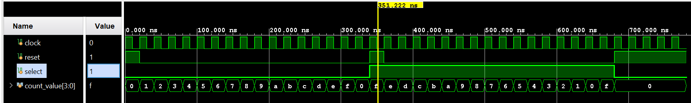

# run 1000ns

time=0,  clear=1  select=0  count= 0

time=20000,  clear=0  select=0  count= 1

time=40000,  clear=0  select=0  count= 2

time=60000,  clear=0  select=0  count= 3

time=80000,  clear=0  select=0  count= 4

time=100000,  clear=0  select=0  count= 5

time=120000,  clear=0  select=0  count= 6

time=140000,  clear=0  select=0  count= 7

time=160000,  clear=0  select=0  count= 8

time=180000,  clear=0  select=0  count= 9

time=200000,  clear=0  select=0  count=10

time=220000,  clear=0  select=0  count=11

time=240000,  clear=0  select=0  count=12

time=260000,  clear=0  select=0  count=13

time=280000,  clear=0  select=0  count=14

time=300000,  clear=0  select=0  count=15

time=320000,  clear=0  select=0  count= 0

time=340000,  clear=1  select=1  count=15

time=360000,  clear=0  select=1  count=14

time=380000,  clear=0  select=1  count=13

time=400000,  clear=0  select=1  count=12

time=420000,  clear=0  select=1  count=11

time=440000,  clear=0  select=1  count=10

time=460000,  clear=0  select=1  count= 9

time=480000,  clear=0  select=1  count= 8

time=500000,  clear=0  select=1  count= 7

time=520000,  clear=0  select=1  count= 6

time=540000,  clear=0  select=1  count= 5

time=560000,  clear=0  select=1  count= 4

time=580000,  clear=0  select=1  count= 3

time=600000,  clear=0  select=1  count= 2

time=620000,  clear=0  select=1  count= 1

time=640000,  clear=0  select=1  count= 0

time=660000,  clear=0  select=1  count=15

time=680000,  clear=1  select=0  count= 0

