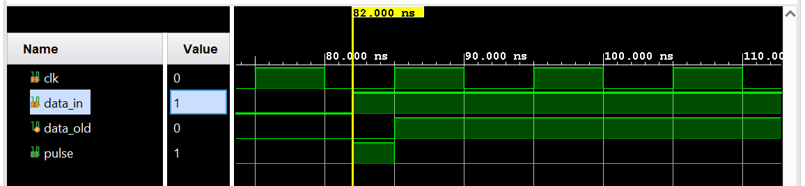
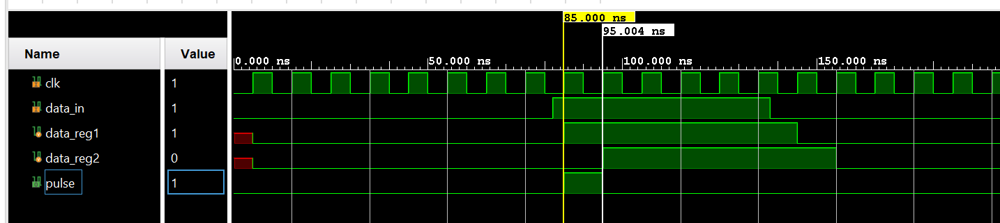
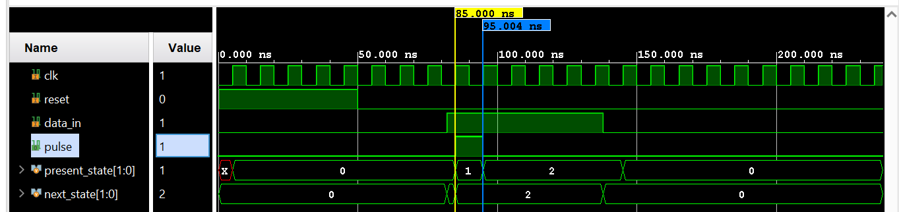
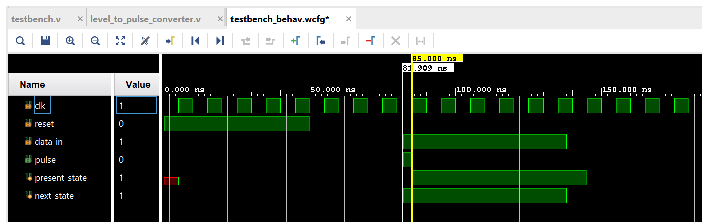
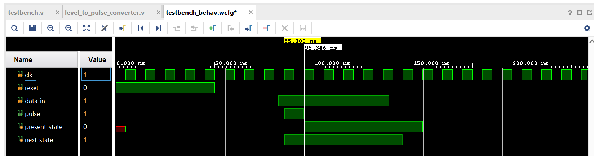

The level to pulse converter is able to detect a single output pulse for one clock period when the input data goes high. The output pulse must deassert itself even if the input data remains high for several cycles. 

This can be implemented through several ways: Either by registering the inputs or by implementing the same using a Finite State Machine!! 

1. level_to_pulse_converter_registered_once.v : Register input data and take datain && !datareg, i.e the pulse will be detected for a very short time when datain has become high and deasserts itself when datareg becomes high. However there is a major disadvantage with this ciruit, if the datain goes high very close to the next rising edge of the clock, then the pulse will be high for a very short amount of time and hence highly prone to glitches at high frequencies. 

2. level_to_pulse_converter_registered_twice.v : The ideal output pulse should be high for one full clock cycle. So we could register the output through two stages. The output will be delayed however, the pulse would be high for one full clock cycle which free of glitches.

3. level_to_pulse_converter_moore.v : The moore machine has three state encodings: IDLE, PULSE and LEVEL. The output waveform for moore machine is similar to the registering twice method. Hence, produces an output without glitch. 

present state  Input    Next State  Output
IDLE             0        IDLE        0
IDLE             1        PULSE       0
PULSE            0        IDLE        1
PULSE            1        LEVEL       1
LEVEL            0        IDLE        0
LEVEL            1        LEVEL       0

4. level_to_pulse_converter_mealy.v : The mealy machine only requires two state encodings: IDLE and PULSE. However, the output waveform is prone to glitches just like registering it once from the input_registering method. 

 

present state    Input     Next State     Output
IDLE               0          IDLE          0
IDLE               1          PULSE         1
PULSE              0          IDLE          0
PULSE              1          PULSE         0

5. level_to_pulse_converter_mealy_registerted_input.v : To remove the glitchy output from the mealy machine, we can register the input once and send the registered value into the mealy machine and this can also remove the glitches. 

I have implemented the same level to pulse converter using several mechanisms. However, the final conlusion comes down to the fact that using a single FF gives an instanataneous result, however is prone to glitches. Using two flip flops in the design will result in a delayed output but is free of glitches. 
