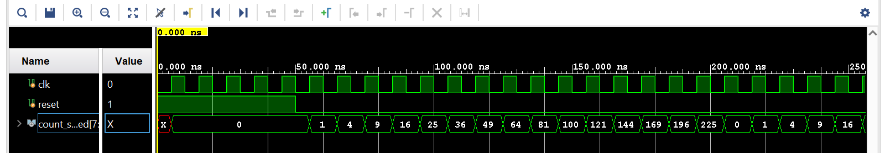
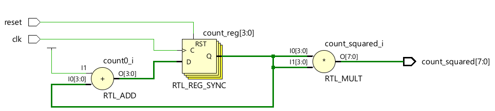
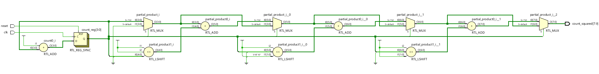

I want to create a multiplier that counts numbers as N squared instead of N. 

Count         = 0 , 1 , 2 , 3 , 04 , 05 , 06
Squared count = 0 , 1 , 4 , 9 , 16 , 25 , 36 and so on. 

This waveform shows how a typical n squared multiplier should behave.

Different implementations: 

1. N squared counter: Use a simple multiplier to do the multiplication. However, as we go to large numbers, multiplication results in a much higher compute. As can be seen in the schematic, it uses an adder to add count and 1 at every posedge of clock, 4 registers to maintain the state of count and a 4-bit input multiplier to get an 8-bit multiplied output. 

2. N squared counter using shift and add: We can still use the same adder to add count and 1 at every posedge of clock along with 4 registers to maintain the state of count. However, instead of using a 4-bit input multiplier to generate an 8-bit multiplied output, will use a shift and add style multiplier. 

1000 x 1001 = 1000x1 + (1000<<1)x0 + (1000<<2)x0 + (1000<<3)x1.
a x b       = a x b[0] + (a<<1) x b[1] + (a<<2) x b[2] + (a<<3) x b[3].

By using this style of multiplier, the multiplier in our conventional counter multiplier will be replaced by a bunch of shifters, adders and multiplexers. This is heavily advantageous for multipliers with large input width's to result in less power consumption as a direct multiplier is a heavy compute element. 

3. N squared counter using previous N square: We know that (n+1)^2 is n^2 + 2n + 1. If we remember the state of the present count squared (n^2) and present count n, we can calculate the next count square.
