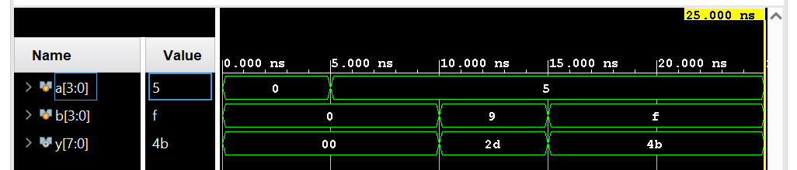
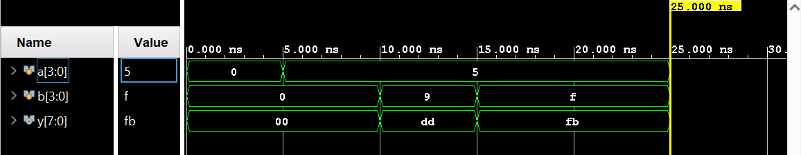

I have designed both signed and unsigned multipliers and used the same testbench to both the DUT's. 

While unisgned mutliplier treats them as unsigned bits, the signed multiplier treats them as number's in their 2's complement format. 

For example, 1111 is being treated as 15 in unsigned format, whereas -1 in the signed format. 

Unsigned Multiplier Waveform: 

Signed Multiplier Waveform:
 

We can observe that both the unsigned and signed multipliers result in different outptuts when instantiated within the same testbench. That means the same input stimulus treats them as different values when different DUT's are used. 
