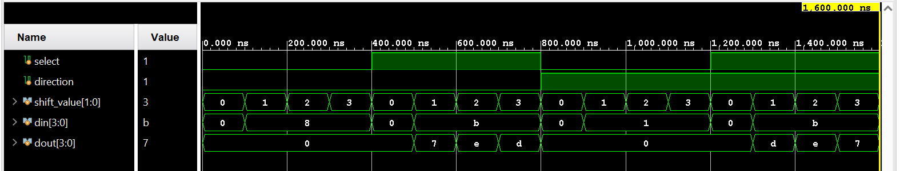

Barrel Shifter

The Barrel Shifter is capable of performing shift or rotate operations by a specified number of bits and is a purely combinational circuit. 

This RTL model supports logical shift left, logical shift right, rotate left, rotate right operations by either 1,2 or 3 positions.

