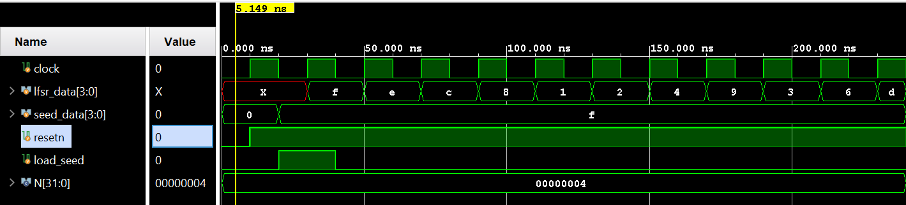

LINEAR FEEDBACK SHIFT REGISTER

This ia a parameterized linear feedback shift register where in all the bits are left shifted by 1 and the LSB bit is replaced by the XOR of the first two MSB bits.

