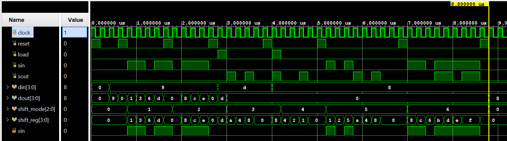

Universal Shift Register: 

A universal shift register is a register which has both the right shift and left whift with both serial and parallel loading capabilities. 

It is a bidirectional shift register since it is capable of shifting data in both the left and right direction. 

These Universal Shift Registers are used as memory elements in computers. 

They can perform either of the following mentioned operation: 

--> PIPO    : Parallel In Parallel Out

--> SIPO-L  : Left Shift Serial In Parallel Out

--> SIPO-R  : Right Shift Serial In ParalleL Out

--> PISO-L  : Parallel In Left Shift Serial Out

--> PISO-R  : Parallel In Right Shift Serial Out

--> SISO-L  : Left Shift Serial In Left Shift Serial Out

--> SISO-R  : Right Shift Serial IN Right Shift Serial Out

